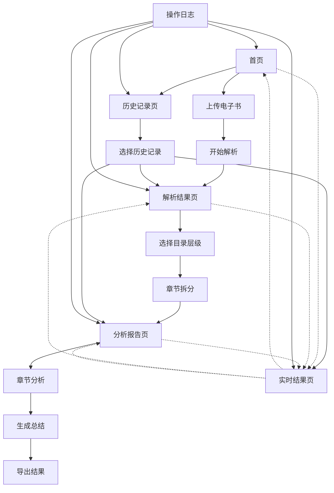

## 1. Product Overview
电子书解析AI工具是一个智能化的电子书内容分析平台，通过EPUB解析技术和AI大模型，自动提取电子书的结构化信息并生成深度内容分析报告。
- 解决电子书内容快速理解和结构化分析的需求，帮助读者、研究者和内容创作者快速掌握书籍核心内容
- 目标用户包括学者、内容创作者、读书爱好者等需要快速理解书籍内容的用户群体

## 2. Core Features

### 2.1 Feature Module
我们的电子书解析AI工具包含以下主要页面：
1. **首页**：文件上传区域、解析状态显示、功能导航、操作日志面板、历史记录入口
2. **历史记录页**：历史解析记录列表、记录状态显示、继续操作入口、记录管理
3. **解析结果页**：书籍信息展示、目录结构显示、章节拆分控制
4. **分析报告页**：章节分析结果、书籍总结报告、JSON数据导出
5. **实时结果页**：当前JSON结果预览、进度状态显示、数据完整性检查

### 2.2 Page Details

| Page Name | Module Name | Feature description |
|-----------|-------------|---------------------|
| 首页 | 文件上传模块 | 支持EPUB格式电子书文件拖拽上传，显示上传进度和文件信息验证 |
| 首页 | 解析控制模块 | 【开始解析】按钮触发EPUB解析，实时显示解析进度和状态 |
| 解析结果页 | 书籍信息展示 | 显示解析出的书籍标题、作者、出版社等基本信息和封面图片 |
| 解析结果页 | 目录结构展示 | 树形结构展示完整目录，支持展开/折叠，显示层级关系 |
| 解析结果页 | 章节拆分控制 | 目录层级选择器（1-3级），【章节拆分】按钮执行内容拆分 |
| 分析报告页 | 章节分析模块 | 【章节分析】按钮调用DeepSeek API分析各章节内容，显示分析进度 |
| 分析报告页 | 书籍总结模块 | 【生成总结】按钮基于章节分析生成整体书籍总结报告 |
| 分析报告页 | 结果导出模块 | 按JSON模板格式展示和导出完整分析结果 |
| 全局 | 操作日志模块 | 实时记录每个操作步骤，显示时间戳、状态和详细信息 |
| 全局 | 导航切换模块 | 顶部导航栏支持任意阶段切换到结果预览页面 |
| 历史记录页 | 记录列表模块 | 展示所有历史解析记录，包含书籍名称、上传时间、解析状态 |
| 历史记录页 | 记录操作模块 | 查看详情、继续解析、删除记录等操作按钮 |
| 历史记录页 | 状态筛选模块 | 按解析状态筛选记录（全部、进行中、已完成、失败） |
| 实时结果页 | JSON预览模块 | 实时展示当前已完成的JSON数据，未完成字段显示占位符 |
| 实时结果页 | 进度指示模块 | 显示整体解析进度和各模块完成状态 |

## 3. Core Process

用户操作流程：
1. 用户在首页上传EPUB格式电子书文件，操作日志开始记录
2. 点击【开始解析】按钮，系统解析书籍基本信息、封面和目录结构
3. 在解析结果页查看书籍信息，选择目录层级（默认1级）
4. 点击【章节拆分】按钮，系统按选定层级拆分章节内容
5. 在分析报告页点击【章节分析】，AI分析各章节内容
6. 点击【生成总结】，AI生成整体书籍总结
7. 查看和导出完整的JSON格式分析报告

**历史记录功能流程：**
- 用户可在首页点击【历史记录】按钮进入历史记录页面
- 历史记录页展示所有已上传的电子书解析记录，包含书籍名称、上传时间、解析状态
- 用户可选择任一历史记录查看其解析结果，或继续未完成的解析过程
- 支持按状态筛选记录（全部、进行中、已完成、失败）
- 用户可删除不需要的历史记录

**增强功能流程：**
- 整个过程中，用户可随时点击顶部【查看结果】按钮切换到实时结果页
- 操作日志面板实时显示每个步骤的执行状态、耗时和详细信息
- 实时结果页展示当前已完成的JSON数据，未完成部分显示"待处理"占位符
- 所有解析过程自动保存到浏览器本地存储，支持断点续传

## 4. User Interface Design

### 4.1 Design Style
- 主色调：深蓝色(#1e3a8a)和浅蓝色(#3b82f6)，辅助色为灰色(#6b7280)
- 按钮样式：圆角矩形，渐变背景，悬停效果
- 字体：中文使用思源黑体，英文使用Inter，主要字号14px-18px
- 布局风格：卡片式设计，顶部导航栏，左右分栏布局
- 图标风格：线性图标，配合📚📄🔍等书籍相关emoji

### 4.2 Page Design Overview

| Page Name | Module Name | UI Elements |
|-----------|-------------|-------------|
| 首页 | 文件上传模块 | 虚线边框拖拽区域，上传图标，进度条，文件信息卡片 |
| 首页 | 解析控制模块 | 蓝色渐变按钮，加载动画，状态提示文字 |
| 首页 | 操作日志面板 | 右侧固定面板，时间轴样式，状态图标，可折叠展开 |
| 首页 | 历史记录入口 | 【历史记录】按钮，显示记录数量徽章，快速访问入口 |
| 历史记录页 | 记录列表区域 | 卡片式布局，书籍封面缩略图，标题作者信息，状态标签 |
| 历史记录页 | 状态筛选栏 | 标签页样式筛选器，状态计数显示，搜索框 |
| 历史记录页 | 记录操作区域 | 查看详情按钮，继续解析按钮，删除按钮，批量操作 |
| 解析结果页 | 书籍信息展示 | 封面图片展示区，信息列表卡片，标签样式分类 |
| 解析结果页 | 目录结构展示 | 树形组件，展开/折叠图标，层级缩进，类型图标 |
| 解析结果页 | 章节拆分控制 | 下拉选择器，操作按钮组，进度指示器 |
| 分析报告页 | 章节分析模块 | 章节列表卡片，分析按钮，进度条，结果预览 |
| 分析报告页 | 书籍总结模块 | 总结内容卡片，关键词标签，生成按钮 |
| 分析报告页 | 结果导出模块 | JSON代码展示区，复制按钮，下载按钮 |
| 全局 | 顶部导航栏 | Logo区域，页面切换标签，【查看结果】按钮，【历史记录】按钮，进度指示器 |
| 实时结果页 | JSON预览区 | 代码编辑器样式，语法高亮，折叠展开，占位符显示 |
| 实时结果页 | 进度状态栏 | 环形进度图，模块完成状态，预计剩余时间 |
| 实时结果页 | 数据完整性检查 | 字段完成度列表，缺失项提醒，数据验证状态 |

### 4.3 Responsiveness
桌面优先设计，支持平板和移动端自适应，考虑触摸交互优化，最小支持宽度768px。