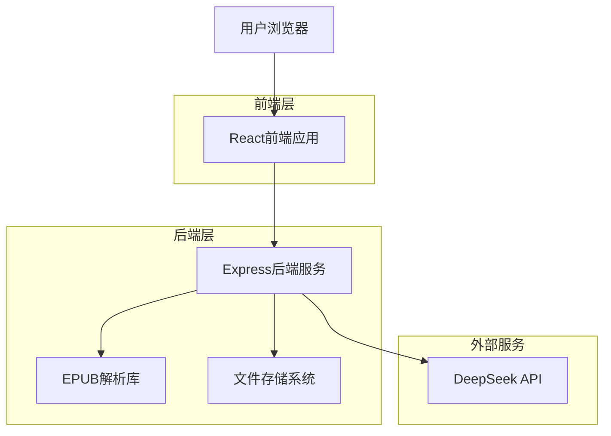
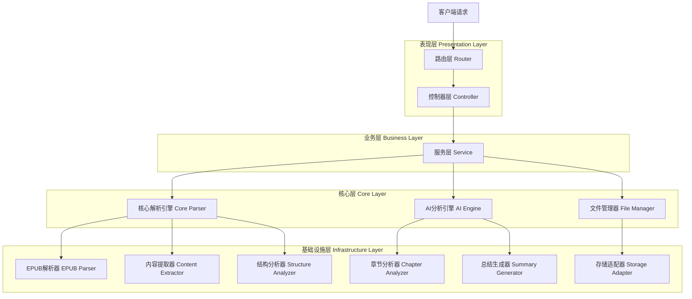
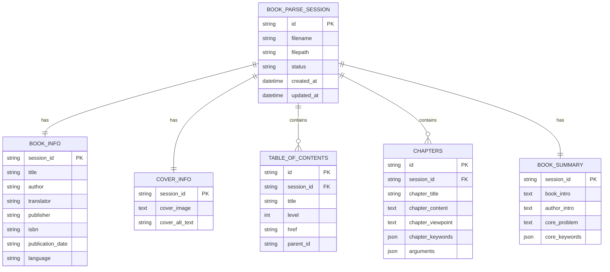

## 1. Architecture design



## 2. Technology Description

* Frontend: React\@18 + TypeScript + Tailwind CSS + Vite

* Backend: Express\@4 + TypeScript + Multer + EbookLib

* External Services: DeepSeek API

## 3. Route definitions

| Route             | Purpose           |
| ----------------- | ----------------- |
| /                 | 首页，电子书上传和解析入口     |
| /history          | 历史记录页，显示所有解析记录   |
| /parse-result     | 解析结果页，显示书籍信息和目录结构 |
| /analysis-report  | 分析报告页，章节分析和书籍总结   |
| /real-time-result | 实时结果页，JSON预览和进度状态 |

## 4. API definitions

### 4.1 Core API

电子书上传接口

```
POST /api/upload
```

Request: FormData

| Param Name | Param Type | isRequired | Description |
| ---------- | ---------- | ---------- | ----------- |
| file       | File       | true       | EPUB格式电子书文件 |

Response:

| Param Name | Param Type | Description |
| ---------- | ---------- | ----------- |
| success    | boolean    | 上传是否成功      |
| fileId     | string     | 文件唯一标识      |
| message    | string     | 响应消息        |

电子书解析接口

```
POST /api/parse
```

Request:

| Param Name | Param Type | isRequired | Description |
| ---------- | ---------- | ---------- | ----------- |
| fileId     | string     | true       | 文件唯一标识      |

Response:

| Param Name      | Param Type | Description |
| --------------- | ---------- | ----------- |
| success         | boolean    | 解析是否成功      |
| bookInfo        | object     | 书籍基本信息      |
| coverInfo       | object     | 封面信息        |
| tableOfContents | array      | 目录结构        |

章节拆分接口

```
POST /api/split-chapters
```

Request:

| Param Name | Param Type | isRequired | Description |
| ---------- | ---------- | ---------- | ----------- |
| fileId     | string     | true       | 文件唯一标识      |
| level      | number     | true       | 目录层级(1-3)   |

Response:

| Param Name | Param Type | Description |
| ---------- | ---------- | ----------- |
| success    | boolean    | 拆分是否成功      |
| chapters   | array      | 章节内容列表      |

章节分析接口

```
POST /api/analyze-chapters
```

Request:

| Param Name | Param Type | isRequired | Description |
| ---------- | ---------- | ---------- | ----------- |
| fileId     | string     | true       | 文件唯一标识      |
| chapters   | array      | true       | 章节内容列表      |

Response:

| Param Name     | Param Type | Description |
| -------------- | ---------- | ----------- |
| success        | boolean    | 分析是否成功      |
| analysisResult | array      | 章节分析结果      |

书籍总结接口

```
POST /api/generate-summary
```

Request:

| Param Name | Param Type | isRequired | Description |
| ---------- | ---------- | ---------- | ----------- |
| fileId     | string     | true       | 文件唯一标识      |
| bookInfo   | object     | true       | 书籍基本信息      |
| chapters   | array      | true       | 章节分析结果      |

Response:

| Param Name  | Param Type | Description |
| ----------- | ---------- | ----------- |
| success     | boolean    | 生成是否成功      |
| bookSummary | object     | 书籍总结信息      |

操作日志接口

```
GET /api/logs/:fileId
```

Response:

| Param Name | Param Type | Description |
| ---------- | ---------- | ----------- |
| logs       | array      | 操作日志列表      |

实时结果获取接口

```
GET /api/result/:fileId
```

Response:

| Param Name | Param Type | Description |
| ---------- | ---------- | ----------- |
| result     | object     | 当前JSON结果数据  |
| progress   | object     | 各模块完成进度     |
| status     | string     | 整体处理状态      |

历史记录获取接口

```
GET /api/history
```

Response:

| Param Name | Param Type | Description |
| ---------- | ---------- | ----------- |
| records    | array      | 历史记录列表      |
| total      | number     | 记录总数        |

删除历史记录接口

```
DELETE /api/history/:fileId
```

Response:

| Param Name | Param Type | Description |
| ---------- | ---------- | ----------- |
| success    | boolean    | 删除是否成功      |
| message    | string     | 响应消息        |

## 5. 模块化代码架构设计

### 5.1 整体架构分层



### 5.2 模块组织结构

```
src/
├── controllers/           # 控制器层
│   ├── upload.controller.ts
│   ├── parse.controller.ts
│   ├── analysis.controller.ts
│   └── result.controller.ts
├── services/             # 服务层
│   ├── book-parse.service.ts
│   ├── ai-analysis.service.ts
│   └── log.service.ts
├── core/                 # 核心解析引擎
│   ├── parsers/          # 解析器模块
│   │   ├── base-parser.ts
│   │   ├── epub-parser.ts
│   │   └── parser-factory.ts
│   ├── extractors/       # 内容提取器
│   │   ├── base-extractor.ts
│   │   ├── metadata-extractor.ts
│   │   ├── toc-extractor.ts
│   │   ├── content-extractor.ts
│   │   └── cover-extractor.ts
│   ├── analyzers/        # 结构分析器
│   │   ├── base-analyzer.ts
│   │   ├── chapter-splitter.ts
│   │   └── content-normalizer.ts
│   └── index.ts
├── ai/                   # AI分析引擎
│   ├── providers/        # AI服务提供者
│   │   ├── base-provider.ts
│   │   ├── deepseek-provider.ts
│   │   └── provider-factory.ts
│   ├── analyzers/        # AI分析器
│   │   ├── chapter-analyzer.ts
│   │   └── summary-generator.ts
│   ├── prompts/          # 提示词模板
│   │   ├── chapter-analysis.prompt.ts
│   │   └── summary-generation.prompt.ts
│   └── index.ts
├── storage/              # 存储管理
│   ├── adapters/
│   │   ├── base-adapter.ts
│   │   ├── local-adapter.ts
│   │   └── adapter-factory.ts
│   └── index.ts
├── utils/                # 工具类
│   ├── logger.ts
│   ├── validator.ts
│   ├── error-handler.ts
│   └── config.ts
├── types/                # 类型定义
│   ├── book.types.ts
│   ├── parser.types.ts
│   ├── ai.types.ts
│   └── common.types.ts
└── app.ts               # 应用入口
```

### 5.3 核心接口设计

```typescript
// 基础解析器接口
interface IBaseParser {
  parse(filePath: string): Promise<ParseResult>;
  validate(filePath: string): Promise<boolean>;
  getSupportedFormats(): string[];
}

// 内容提取器接口
interface IContentExtractor {
  extract(source: any): Promise<ExtractResult>;
  getExtractorType(): ExtractorType;
}

// AI分析提供者接口
interface IAIProvider {
  analyze(content: string, prompt: string): Promise<AnalysisResult>;
  getProviderName(): string;
  validateConfig(): boolean;
}

// 存储适配器接口
interface IStorageAdapter {
  save(key: string, data: any): Promise<void>;
  load(key: string): Promise<any>;
  delete(key: string): Promise<void>;
  exists(key: string): Promise<boolean>;
}
```

### 5.4 通用解析策略

```typescript
// 解析策略配置
interface ParseStrategy {
  name: string;
  priority: number;
  matcher: (file: any) => boolean;
  extractor: IContentExtractor;
}

// 解析器工厂
class ParserFactory {
  private strategies: Map<string, ParseStrategy> = new Map();
  
  registerStrategy(strategy: ParseStrategy): void {
    this.strategies.set(strategy.name, strategy);
  }
  
  createParser(filePath: string): IBaseParser {
    // 根据文件类型和内容特征选择最适合的解析策略
    const strategies = Array.from(this.strategies.values())
      .sort((a, b) => b.priority - a.priority);
    
    for (const strategy of strategies) {
      if (strategy.matcher(filePath)) {
        return new GenericParser(strategy);
      }
    }
    
    throw new Error('No suitable parser found');
  }
}
```

### 5.5 错误处理机制

```typescript
// 统一错误类型
enum ErrorType {
  PARSE_ERROR = 'PARSE_ERROR',
  VALIDATION_ERROR = 'VALIDATION_ERROR',
  AI_SERVICE_ERROR = 'AI_SERVICE_ERROR',
  STORAGE_ERROR = 'STORAGE_ERROR',
  NETWORK_ERROR = 'NETWORK_ERROR'
}

// 错误处理器
class ErrorHandler {
  static handle(error: Error, context: string): ProcessedError {
    const processedError = {
      type: this.categorizeError(error),
      message: this.sanitizeMessage(error.message),
      context,
      timestamp: new Date(),
      recoverable: this.isRecoverable(error)
    };
    
    this.logError(processedError);
    return processedError;
  }
  
  private static categorizeError(error: Error): ErrorType {
    // 根据错误特征自动分类
    if (error.message.includes('parse')) return ErrorType.PARSE_ERROR;
    if (error.message.includes('validation')) return ErrorType.VALIDATION_ERROR;
    // ... 其他分类逻辑
    return ErrorType.PARSE_ERROR;
  }
}
```

### 5.6 插件扩展架构

```typescript
// 插件接口
interface IPlugin {
  name: string;
  version: string;
  initialize(): Promise<void>;
  process(data: any): Promise<any>;
  cleanup(): Promise<void>;
}

// 插件管理器
class PluginManager {
  private plugins: Map<string, IPlugin> = new Map();
  
  async loadPlugin(plugin: IPlugin): Promise<void> {
    await plugin.initialize();
    this.plugins.set(plugin.name, plugin);
  }
  
  async executePlugins(data: any, stage: string): Promise<any> {
    let result = data;
    for (const plugin of this.plugins.values()) {
      if (this.shouldExecuteAtStage(plugin, stage)) {
        result = await plugin.process(result);
      }
    }
    return result;
  }
}
```

## 6. Data model

### 6.1 Data model definition



### 6.2 Data Definition Language

由于本项目主要处理临时文件和内存数据，不需要持久化数据库。数据结构主要通过TypeScript接口定义：

```typescript
// 书籍解析会话
interface BookParseSession {
  id: string;
  filename: string;
  filepath: string;
  status: 'uploading' | 'parsing' | 'splitting' | 'analyzing' | 'completed' | 'error';
  createdAt: Date;
  updatedAt: Date;
}

// 书籍基本信息
interface BookInfo {
  title: string;
  author: string;
  translator?: string;
  publisher: string;
  isbn: string;
  publication_date: string;
  language: string;
}

// 封面信息
interface CoverInfo {
  cover_image: string; // base64编码
  cover_alt_text: string;
}

// 目录项
interface TocItem {
  id: string;
  title: string;
  level: number;
  href: string;
  parent_id: string | null;
}

// 章节分析结果
interface Chapter {
  chapter_title: string;
  chapter_viewpoint: string;
  chapter_keywords: string[];
  arguments: Argument[];
}

// 论据信息
interface Argument {
  statement: string;
  positive_case: string[];
  negative_case: string[];
  citations: Citation[];
}

// 引用信息
interface Citation {
  cited_source: string;
  cited_type: '书籍' | '文章' | '故事' | '权威观点';
  viewpoint: string;
}

// 书籍总结
interface BookSummary {
  book_intro: string;
  author_intro: string;
  core_problem: string;
  core_keywords: string[];
}

// 操作日志
interface OperationLog {
  id: string;
  fileId: string;
  timestamp: Date;
  operation: string;
  status: 'pending' | 'processing' | 'completed' | 'error';
  message: string;
  duration?: number;
  details?: any;
}

// 进度状态
interface ProgressStatus {
  fileId: string;
  overall: number; // 整体进度百分比
  modules: {
    upload: boolean;
    parse: boolean;
    split: boolean;
    analyze: boolean;
    summary: boolean;
  };
  currentStep: string;
  estimatedTime?: number;
}

// 实时结果
interface RealTimeResult {
  fileId: string;
  bookInfo?: Partial<BookInfo>;
  coverInfo?: Partial<CoverInfo>;
  tableOfContents?: TocItem[];
  chapters?: Partial<Chapter>[];
  bookSummary?: Partial<BookSummary>;
  progress: ProgressStatus;
  lastUpdated: Date;
}

// 历史记录项
interface HistoryRecord {
  id: string;
  filename: string;
  fileSize: number;
  uploadTime: Date;
  lastAccessTime: Date;
  status: 'uploading' | 'parsing' | 'splitting' | 'analyzing' | 'completed' | 'error';
  progress: ProgressStatus;
  bookInfo?: Partial<BookInfo>;
  coverThumbnail?: string; // base64缩略图
  resultData?: RealTimeResult;
  errorMessage?: string;
}

// 历史记录管理器
interface HistoryManager {
  saveRecord(record: HistoryRecord): void;
  getRecords(filter?: HistoryFilter): HistoryRecord[];
  getRecord(id: string): HistoryRecord | null;
  deleteRecord(id: string): boolean;
  updateRecord(id: string, updates: Partial<HistoryRecord>): boolean;
  clearAll(): void;
}

// 历史记录筛选条件
interface HistoryFilter {
  status?: string[];
  dateRange?: {
    start: Date;
    end: Date;
  };
  keyword?: string;
  sortBy?: 'uploadTime' | 'lastAccessTime' | 'filename';
  sortOrder?: 'asc' | 'desc';
}
```

